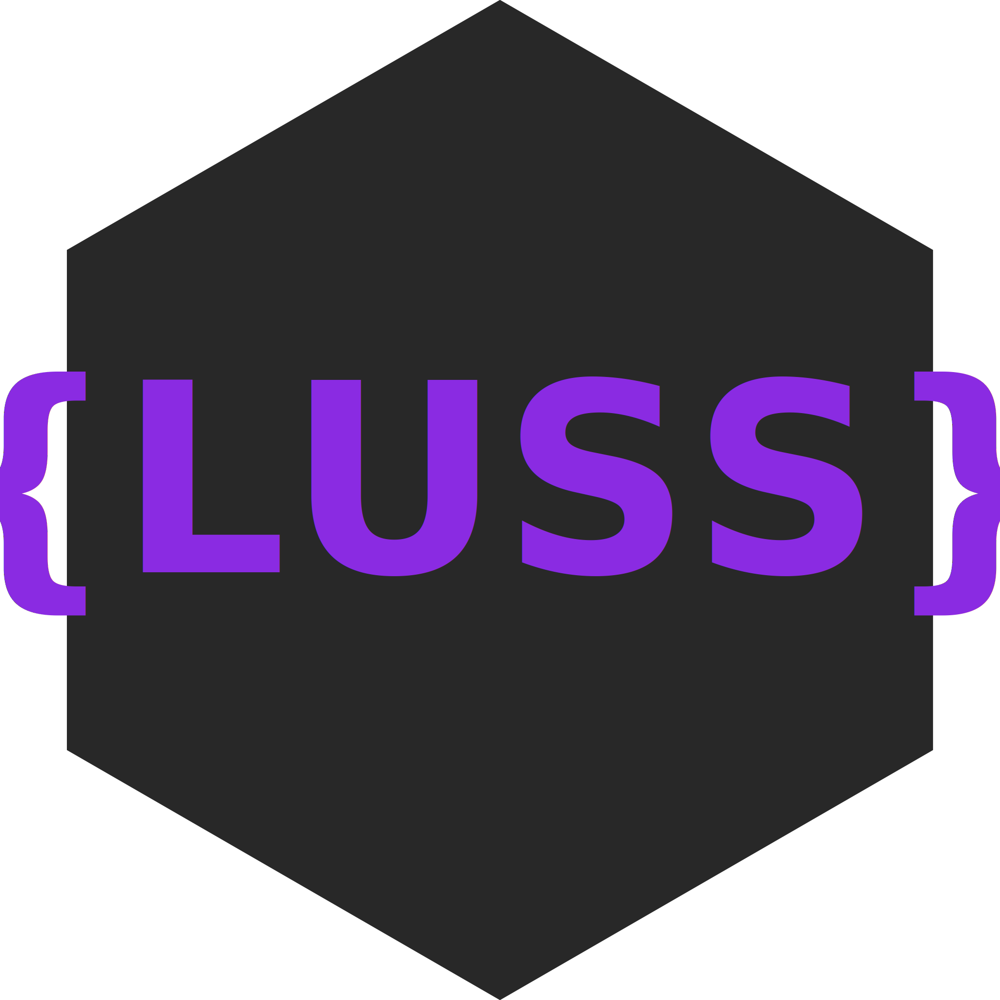

# {LUSS}

> ⚠ **Warning**
> With version 2.0, the library installation has undergone changes. For more information, visit the [Installation](#-installation) section

## 💻 Author
[**Sanalzio (me)**](https://sanalzio.github.io/)

## 💬 Description
A CSS framework that enables you to easily organize the style of a web page.

## ✔ Installation
**The library has been modularized for use in JavaScript as well.**
- Paste this tag into the head tag in your html code:
    ```html
    <script defer src="https://rawcdn.githack.com/sanalzio/-LUSS-/master/luss.js" type="module"></script>
    ```

## [📙 Click to go Documentation](https://sanalzio.github.io/-LUSS-/doc.html)

## [🎬 Click to go Demo](https://sanalzio.github.io/-LUSS-/demo.html)

## 📋 License
[**MIT**](https://raw.githubusercontent.com/sanalzio/-LUSS-/master/LICENSE)