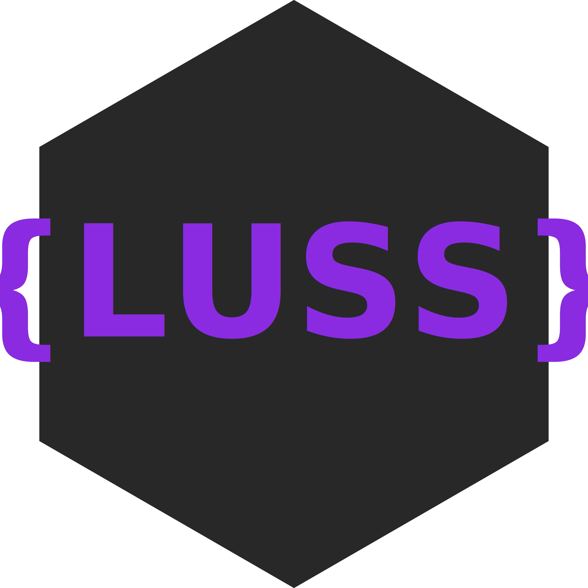

# {LUSS}

> ⚠ **Warning**
> With version 2.0, the library installation has undergone changes. For more information, visit the [Installation](#-installation) section

## 💻 Author
[**Sanalzio (me)**](https://sanalzio.github.io/)

## 💬 Description
A CSS framework that enables you to easily organize the style of a web page.

## 📋 Table of Contents
- [{LUSS}](#luss)
  - [💻 Author](#-author)
  - [💬 Description](#-description)
  - [📋 Table of Contents](#-table-of-contents)
  - [✔ Installation](#-installation)
  - [🚀 Usage](#-usage)
  - [✨ Functions](#-functions)
    - [Variable assignment](#variable-assignment)
    - [Math](#math)
    - [random integer](#random-integer)
    - [date](#date)
    - [if](#if)
    - [else](#else)
    - [js](#js)
    - [inline if](#inline-if)
    - [get style](#get-style)
    - [random color](#random-color)
    - [rgb to hex](#rgb-to-hex)
    - [each](#each)
    - [interval](#interval)
    - [New Pseudo-classes](#new-pseudo-classes)
      - [inner](#inner)
      - [outer](#outer)
    - [String Functions](#string-functions)
      - [upper, lower](#upper-lower)
      - [escape](#escape)
  - [For JavaScript](#for-javascript)
    - [luss function](#luss-function)
    - [lussmain function](#lussmain-function)

## ✔ Installation
**The library has been modularized for use in JavaScript as well.**
- Paste this tag into the head tag in your html code:
    ```html
    <script defer src="https://rawcdn.githack.com/sanalzio/-LUSS-/master/luss.js" type="module"></script>
    ```

[Back To Top ⬆](#📋-table-of-contents)

## 🚀 Usage
- Create a new `<style>`  tag in the following format and write the code inside it:
    ```html
    <style luss>
        /* Codes */
    </style>
    ```
- Or, use the link tag in the following format to import an external file:
    ```html
    <link rel="luss" href="./style.luss">
    ```

[Back To Top ⬆](#📋-table-of-contents)

## ✨ Functions
### Variable assignment
```css
$text-color: #f2f2f2
$bg-color: black

body{
    color: $text-color;
    background: $bg-color;
}
```

[Back To Top ⬆](#📋-table-of-contents)

### Math
```css
img {
    width: $[1em + 2px];
}
```

[Back To Top ⬆](#📋-table-of-contents)

### random integer
```css
body{
    padding: random(1, 3)rem;
}
```

[Back To Top ⬆](#📋-table-of-contents)

### date
```css
p::after{
    content: "date(day):date(month):date(year)";
}
article::after{
    content: "date()";
}
```

[Back To Top ⬆](#📋-table-of-contents)

### if
```css
$color-scheme: light
@if ("$color-scheme"=="light")
p{
    color: black;
}
end
```
> ![WARNING]
> Each condition statement must be followed by "end" or "###" to avoid including other operations in the condition. And if using a string in a condition, enclose it in double quotes ("").

[Back To Top ⬆](#📋-table-of-contents)

### else
```css
$color-scheme: light
@if ("$color-scheme"=="light")
p{
    color: black;
}
@else
p{
    color: white;
}
end
```

[Back To Top ⬆](#📋-table-of-contents)

### js
```css
p::after{
    content: "@js{(new Date().getMinutes()).toString()}"
}
```

[Back To Top ⬆](#📋-table-of-contents)

### inline if
```css
$color-scheme: light
p{
    color: ("$color-scheme" == "light" ? "black" : "white");
}
```
**Usage**: `(<condition> ? <if condition true reutrn this> : <else return this>)`

[Back To Top ⬆](#📋-table-of-contents)

### get style
```css
p{
    color: gs$ #div1 (color);
}
```

[Back To Top ⬆](#📋-table-of-contents)

### random color
```css
body {
    color: $randomColor;
}
```

[Back To Top ⬆](#📋-table-of-contents)

### rgb to hex
```css
body {
    color: #rgb(255, 0, 0);
}
```

[Back To Top ⬆](#📋-table-of-contents)

### each
```css
$tags: h1:hover | p
each($tags {
    color: orange;
})
each(p:hover | a:active {
    color: red;
})
```

[Back To Top ⬆](#📋-table-of-contents)

### interval
```css
interval(body $1000 {
    color: $randomColor;
})
```

### New Pseudo-classes
#### inner
```css
a::inner{
    content: "<p>Hello</p>";
    color: $randomColor;
}
```

[Back To Top ⬆](#📋-table-of-contents)
#### outer
```css
a::outer{
    content: "<body><p>Hello</p></body>";
    color: $randomColor;
}
```

[Back To Top ⬆](#📋-table-of-contents)

### String Functions
#### upper, lower
```css
a::after{
    content: "lower(HELLO) upper(world)";
}
```

[Back To Top ⬆](#📋-table-of-contents)

#### escape
Escapes the string within the quotation marks.
```css
a::after{
    content: "e('Hello World')";
}
```

[Back To Top ⬆](#📋-table-of-contents)

## For JavaScript

### luss function
It adds the 'luss' style to the page.
```js
import { luss } from "./luss.js"
luss(`

$success: green

body{
    color: $success;
}

`);
```

[Back To Top ⬆](#📋-table-of-contents)

### lussmain function
It compiles the specified 'luss' code and returns the compiled CSS code.
```js
import { lussmain } from "./luss.js"
console.log(lussmain(`

$success: green

body{
    color: $success;
}

`));
```

[Back To Top ⬆](#📋-table-of-contents)